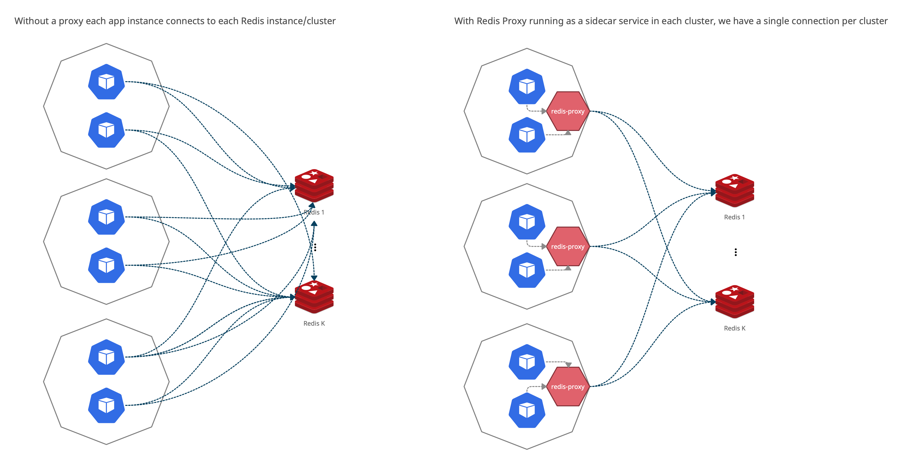

# Redis Proxy

**IMPORTANT 🚧**: This project has been suspended and we don't have plans to complete it in the nearest future.

Redis Proxy aims to reduce the number for concurrent connections to Redis databases from the monolith. Instead of initializing connections to Redis directly, clients connect to the proxy, which multiplex commands (using a small, limited number of _real_ Redis connections).

The proxy is designed to run a sidecar service on a EC2 machine (which runs dozens of app instances).



## Installation

- Make sure Go 1.6+ installed.
- Clone repository.
- Run `make install`.

## Usage

Run proxy with the configuration passed as a JSON file:

```shell
$ redis-proxy -c path/to/config.json

=> INFO[2021-04-20T14:25:56+03:00] context=main Starting Redis Proxy v0.1.0 (pid: 68626)
```

You can also provide configuration parameters through the corresponding environment variables (i.e. `REDIS_PROXY_LOG_LEVEL=debug`, etc).

For more information about available options run `redis-proxy -h`.

### Configuration format

Configuration file describes how to connect to Redis databases (credentials, custom settings):

```json
// TODO: Example
```

**IMPORTANT:** Each database is identified by the uniq **number**. To connect to a database via proxy, a client MUST used this number as a `db` part of the url, e.g., `redis://localhost:6379/42` means connecting to the database with the identifier `"42"`.

See more details in the [docs](docs/architecture.md).

## Development

**NOTE:** Make sure Go 1.6+ installed.

The following commands are available:

```shell
# Build the Go binary (will be available in dist/redis-proxy)
make

# Run Golang tests
make test
```

We use [golangci-lint](https://golangci-lint.run) to lint Go source code:

```sh
make lint
```

We use [gosec](https://github.com/securego/gosec) to scan for possible security issues:

```sh
make sec
```

Other commands:

```sh
# Run vet and vet shadow
make vet

# Run fmt
make fmt
```

**NOTE**: If the commands above fails on MacBook with Apple silicon, try running with `arch -x86_64` prefix.

### Git hooks

To automatically lint and test code before commits/pushes it is recommended to install [Lefthook](https://github.com/evilmartians/lefthook):

```sh
brew install evilmartians/lefthook/lefthook

lefthook install
```

### Redis cluster

To simulate a cluster on local machine we use docker-compose. To start cluster with 3 masters and 3 slaves run:

```sh
# Cluster is available on the 7000-7005 ports by default.
make redis-cluster-up
```

To simulate cluster failover run:

```sh
# SHARDN is a shard number from 1 to n. Default: 1
make stop-shard SHARDN=1

# To start shard again, run:
make start-shard SHARDN=1
```

Benchmark tool provided by Redis is also available as a docker container:

```sh
# By default it will try to connect to the local machine on port 6379
make redis-benchmark HOST=host.docker.internal PORT=6379 DBNUM=0
```

### Links & Resources

Here is the list of relevant resources and tools used to build this app:

- [Redis Protocol spec](https://redis.io/topics/protocol).
- [Redis Cluster spec](https://redis.io/topics/cluster-spec).
- [logrus](https://github.com/sirupsen/logrus): structured, pluggable logging.
- [confita](https://github.com/heetch/confita): configuration management.
- [mockery](https://github.com/vektra/mockery): test mocks.
