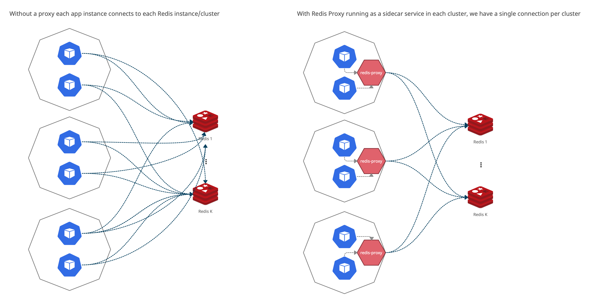

# Architecture

Proxy uses [Redis Protocol](https://redis.io/topics/protocol) to quack like a Redis in non-cluster mode.
It executes client commands, handles `MOVED` and `ASK` redirects and routes Redis responses back to the clients.
It also supports multiple clusters with database number-to-cluster mapping.

## Proxy features

Besides from multiplexing connections, the proxy provides some additional features.

### Transactions

🚧 _Work in progress_

Proxy supports `MULTI` and `EXEC` commands.

During transaction Proxy aggregates commands in memory and flushes it on `EXEC`.

### Scripting

🚧 _Work in progress_

Proxy supports `SCRIPT LOAD` and `EVALSHA` commands.

On `SCRIPT LOAD` proxy loads scripts to each node and keeps in memory to load to newly added nodes,
so it is required to send script to the proxy even if it is already exists on the cluster shards.
